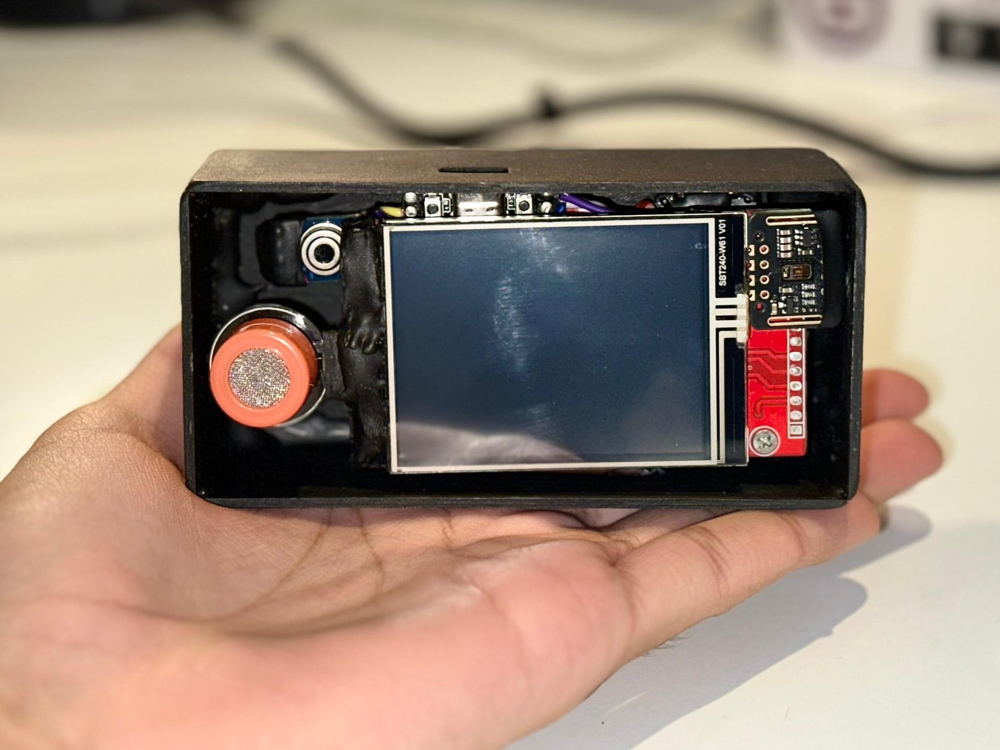
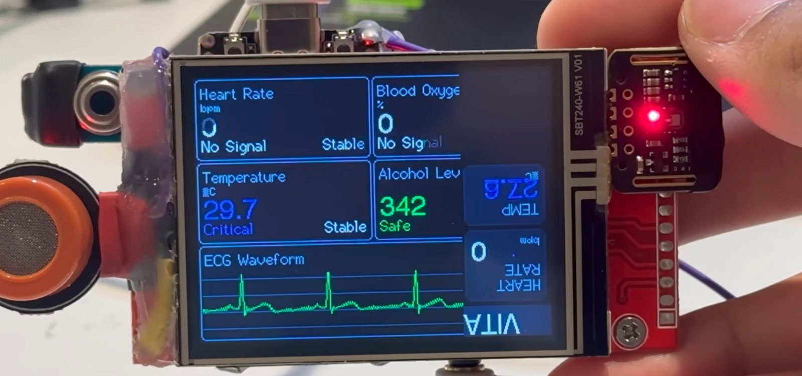
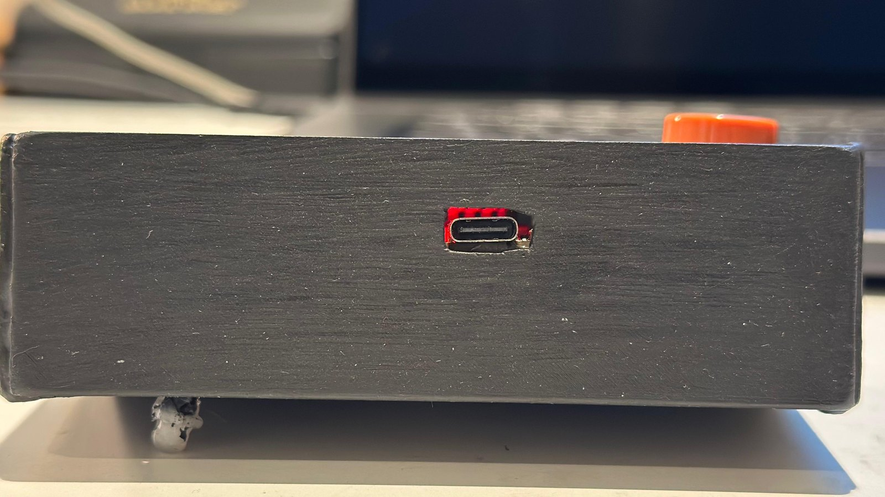

# Multi-Vital Monitor

An ESP32-based vital signs monitor with a live ECG trace, built from discrete
sensor modules on a 320x240 SPI TFT.

Measures heart rate two independent ways and cross-checks them, derives heart
rate variability and respiration rate from the same signals, and reports
temperature and relative alcohol response.

<p align="center">
  
</p>

**Videos:** [All-in-one medical device](https://youtu.be/q9Ee2mhGdnA) · [All-in-one health monitor](https://youtu.be/jfgkhnGlEpk)

---

The firmware is built around a strict rule: every displayed number is either
measured or absent. Nothing is smoothed into existence, no stale value is left
on screen to age quietly, and anything without a valid measurement shows `--`.

---

## What it measures

| Metric | Source | Notes |
|---|---|---|
| Heart rate | ECG R-peaks, PPG as fallback | Shows which source, and flags disagreement |
| HRV (RMSSD, SDNN, pNN50) | ECG R-R intervals | Needs 30 accepted intervals first |
| SpO2 | MAX30102 red/IR ratio | Uncalibrated until fitted |
| Respiration rate | PPG baseline modulation | Least reliable output; needs a still subject |
| Perfusion index | PPG AC/DC | Signal-quality gate for the PPG metrics |
| Surface temperature | MLX90614 with field-of-view correction | Surface, not core |
| Alcohol response | MQ3, Rs/R0 against clean-air baseline | Relative only |
| Supply rail | AD8232 reference level | Trend indicator, no extra components |

---

## Hardware

| Part | Role |
|---|---|
| ESP32 devkit (classic, dual core) | Controller |
| 2.4" 320x240 SPI TFT (ILI9341-class) | Display |
| MAX30102 | Pulse oximetry, PPG |
| MLX90614 | Non-contact IR temperature |
| AD8232 breakout | Single-lead ECG front end |
| MQ3 | Alcohol vapour sensor |

### Wiring

<p align="center">
  
  
</p>

A printable version is in [Circuit.pdf](Circuit.pdf).

**Display (SPI)** — set in TFT_eSPI's `User_Setup.h`, not in the sketch:

| Signal | GPIO |
|---|---|
| CS | 5 |
| DC | 16 |
| RST | 17 |
| SCK | 18 |
| MOSI | 15 |

**MAX30102** on I2C bus 0:

| Signal | GPIO |
|---|---|
| SDA | 21 |
| SCL | 22 |

**MLX90614** on I2C bus 1:

| Signal | GPIO |
|---|---|
| SDA | 25 |
| SCL | 26 |

**AD8232:**

| Signal | GPIO |
|---|---|
| OUTPUT | 33 (ADC1) |
| LO+ | 35 |
| LO- | 32 |
| SDN | not connected |

**MQ3:**

| Signal | GPIO |
|---|---|
| AOUT | 39 (ADC1) |

### Wiring notes

- **GPIO 34, 35, 36 and 39 are input-only** on the classic ESP32. They have no
  output driver and no internal pull-ups. The AD8232's SDN line is deliberately
  left unconnected — the breakout holds it high on its own.
- **GPIO 15 is a strapping pin.** It has an internal pull-up and boots high,
  which is fine. Do not tie it externally low or the board will not boot.
- **Both analog inputs are on ADC1** (33 and 39). ADC2 is unusable while WiFi
  is active, so this arrangement leaves the radio available for future use.
- **MOSI on GPIO 15 goes through the GPIO matrix**, not IO_MUX, which caps SPI
  around 40 MHz. Moving MOSI to GPIO 23 unlocks IO_MUX and 80 MHz if you ever
  need faster redraw.
- **Check your MQ3 module's output range.** Many run the heater from 5 V and
  can swing the analog output above 3.3 V. Use a divider if yours does.

---

## Libraries

Install through the Arduino Library Manager:

- `TFT_eSPI` by Bodmer
- `MAX3010x` by eepj
- `Adafruit MLX90614`

Each carries its own license: see [Credits](#credits).

---

## Build and flash

1. Install the ESP32 board package in the Arduino IDE.
2. Install the three libraries above.
3. Configure `TFT_eSPI/User_Setup.h` for your panel and the SPI pins listed
   above.
4. Open `Multi-Vital-device.ino`, select your ESP32 board, and upload. (The Arduino IDE may offer to move
   it into a folder of the same name; accept, and keep `filters.h` next to it.)
5. Open the serial monitor at **115200** and type `help`.

`filters.h` must sit in the same folder as the sketch.

---

## Configuration

All at the top of the sketch.

### Display orientation

```c
#define TFT_ROTATION      1     // 1 or 3 = landscape, 0 or 2 = portrait
#define LAYOUT_PORTRAIT   0     // set to 1 for rotation 0 or 2
```

Every dimension re-derives from these two. Nothing else hardcodes a pixel.

| Orientation | Rotation | LAYOUT_PORTRAIT |
|---|---|---|
| Landscape | 1, or 3 for upside down | 0 |
| Portrait | 0, or 2 for upside down | 1 |

**Verify your panel matches.** Add this after `tft.init()`:

```c
Serial.printf("panel %dx%d, layout expects %dx%d %s\n",
              tft.width(), tft.height(), SCR_W, SCR_H,
              (tft.width() == SCR_W && tft.height() == SCR_H) ? "OK" : "*** MISMATCH ***");
```

A mismatch draws the layout partly off-screen, which looks exactly like a
broken waveform.

### Mains frequency

```c
#define MAINS_HZ  50.0f    // 50 for India/EU, 60 for the Americas
```

Set this correctly. Mains hum survives the low-pass and is then amplified by the
R-peak detector's derivative stage, which walks the detected peak position by
several samples per beat and puts a floor of roughly 25 ms under RMSSD, inside
the physiological range, so HRV becomes noise wearing a number.

### ECG grid

```c
#define ECG_SHOW_VGRID  0    // 1 adds vertical time divisions
```

Vertical divisions are 16 columns apart, which at 83.3 columns/second is 192 ms
, close to a clinical monitor's 200 ms major division, but not equal to it. Do
not measure intervals off the screen assuming 200.

---

## First run

1. Power on. The boot screen reports the reset reason, sensor detection, free
   heap, and sprite allocation. A `BROWNOUT` reset means a power problem, not a
   firmware one.
2. **Leave it powered for the MQ3.** The heater needs 90 seconds from cold, then
   20 seconds of clean air to set its baseline. A sensor stored unpowered for
   months needs far longer — expect a day or two before its baseline settles.
3. **Attach the ECG electrodes to skin**, not just to the board. The display
   says `no ECG signal - check pads` when the leads are connected but nothing
   cardiac is coming through.
4. **Wait about 11 seconds** after the leads connect. The ECG display gain is
   measured over seconds 6 to 11 and then held. Fitting earlier measures the
   baseline tracker converging rather than the heartbeat.
5. Check the status bar reads `250/100Hz`. Those are the measured ECG and PPG
   sample rates. If they drift, the filter corner frequencies are wrong and
   every derived number is suspect — which is why they are on screen
   permanently.

---

## Serial console

115200 baud. `help` lists everything.

| Command | Effect |
|---|---|
| `status` | Full diagnostic dump |
| `spo2 ref <pct>` | Record current R ratio against a reference oximeter reading |
| `spo2 fit` | Least-squares fit and save (needs 3+ spread-out points) |
| `spo2 clear` | Discard collected points and stored coefficients |
| `temp ref <degC>` | Solve the field-of-view fill fraction from a known surface |
| `rail ref <volts>` | Set ADC full scale from a multimeter reading of 3V3 |
| `mq3 zero` | Re-zero the clean-air baseline |
| `gain auto` | Re-measure the ECG display gain over 6 s |
| `gain <counts/px>` | Fix the ECG display gain by hand |
| `gain show` | Report the current ECG gain |
| `raw on` / `raw off` | Stream slow-sensor values |

Calibration persists to NVS.

### Calibrating SpO2 properly

Hold a reference pulse oximeter on one finger and this device on another. Run
`spo2 ref <value>` at three or more genuinely different saturation levels, a
short breath-hold will move it. Then `spo2 fit`. The display switches from
`estimate only` to `calibrated`.

Without this, the SpO2 number is a placeholder formula.

---

## How it works

**Two FreeRTOS tasks on core 0, one on core 1.** `ecgTask` runs a fixed 250 Hz
tick and touches nothing that can block — no I2C, no SPI. `sensorTask` owns all
I2C and is paced by the MAX30102 itself. `renderTask` draws at 50 Hz on core 1.

That separation is the whole point. Reading the MAX30102 FIFO blocks for around
10 ms, so any design that drains it inside the ECG loop paces the ECG at the
PPG's rate, putting every filter corner frequency roughly ten times too low.

**ECG chain, detection:** 50/60 Hz notch, 5-15 Hz band-pass, five-point
derivative, square, 100 ms moving-window integration, adaptive dual threshold
with a 200 ms refractory. Peak position is refined by parabolic interpolation.
The integrator lags the true R peak by a constant amount, which cancels in R-R
intervals.

**ECG chain, display:** separate path — notch, two-pole 30 Hz low-pass, minus a
slowly tracked centre. No high-pass: the AD8232 already high-passes internally,
so its output arrives centred at VS/2. Adding another one is redundant and, as a
biquad starting from zero state, it rings for a second on the initial DC step.

**Display gain is measured once and held**, like a hospital monitor, rather than
adapting continuously. Continuous auto-scaling means the gain moves while you
are looking at the trace and you can never tell whether the signal changed or
the scale did.

**Sweep rendering.** The trace stays still and a cursor moves across it with a
blank gap erasing ahead. Only the new columns are pushed — about 4 KB per
update instead of redrawing the whole strip.

---

## Troubleshooting

| Symptom | Check |
|---|---|
| Layout clipped or partly off screen | Panel size vs `LAYOUT_PORTRAIT` — use the printf above |
| Status bar not showing `250/100Hz` | `status` reports the FreeRTOS tick rate; the ECG task needs at least 250 Hz |
| ECG box shows `no ECG signal` | Electrodes on skin? Dried gel? `status` reports `qrs amp` and `snr` |
| ECG trace tiny or off-centre | `gain auto`, and wait the full 11 s |
| HRV stuck at `0/30` | R-peaks not being detected — same checks as `no ECG signal` |
| Alcohol stuck on `baseline n/20` | Still capturing clean-air baseline; needs 20 s after warm-up |
| Temperature shows `no target` | Aim at skin from 2-5 cm; a room-temperature surface is correctly rejected |
| Random resets | `status` reports the reset reason; `BROWNOUT` means power |

---

## Enclosure

The five panels of the handheld case are in [`hardware/enclosure`](hardware/enclosure) as STL files, ready to slice.

## Earlier version

The first build (early 2026) used one sketch per sensor on a 3.5-inch screen with USB-C charging.
Photos are in [`media/v1`](media/v1), and the original code is archived at
[All-in-one-medical-device](https://github.com/contactmridulhere-commits/All-in-one-medical-device).

<p align="center">
  
  
  
</p>

## Credits

Built by Mridul Sharma and Kaushiki Shukla.

Mridul did most of the hardware build. Kaushiki guided the choice of tools and parts, and what to integrate.

Third-party libraries, each under its own license:

- [TFT_eSPI](https://github.com/Bodmer/TFT_eSPI) by Bodmer
- [MAX3010x](https://github.com/eepj/MAX3010x) by eepj
- [Adafruit MLX90614](https://github.com/adafruit/Adafruit-MLX90614-Library)


---

## License

MIT — see [LICENSE](LICENSE).
